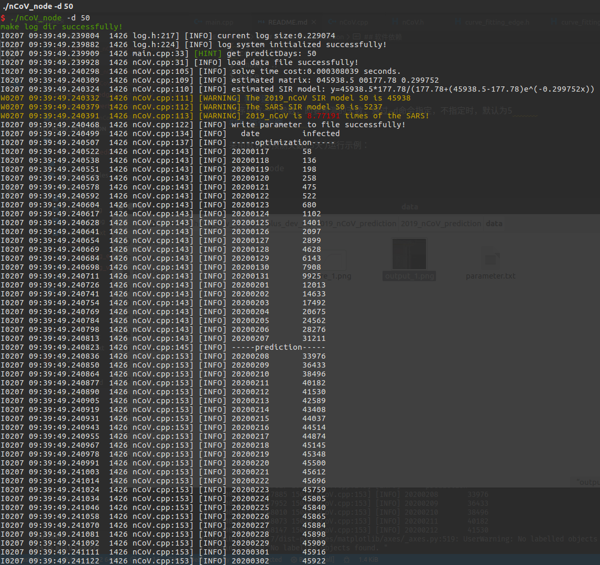
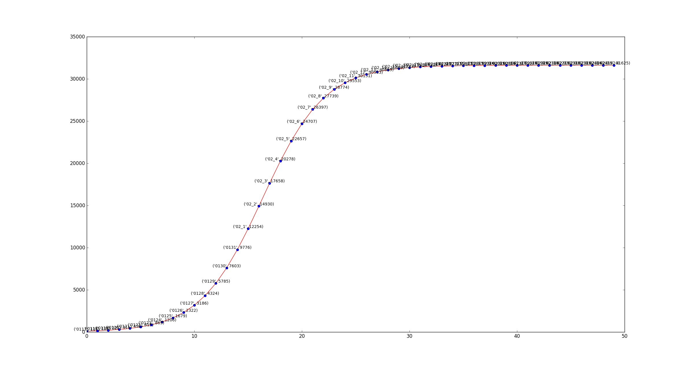

<!--
 * @Author       : PeripateticWind
 * @Email        : PeripateticWind@gmail.com
 * @Company      : Xi'an Jiaotong University
 * @CreateTime   : 2020-02-03 16:29:37
 * @Description  : The readme file of program
 * @FilePath     : /2019_nCoV_prediction/README.md
 * @LastEditors            : PeripateticWind
 * @LastEditTime           : 2020-02-10 13:16:32
 * @youwant      : add what you want
 * @Copyright (c) 2020, PeripateticWind. All rights reserved.
 -->
# 2019_nCoV_prediction

## 介绍
2019_nCoV 每日感染人数预测

## 软件依赖
用到的C++相关库: G2O GLOG(含youibot log system) GFLAGS    
用到的python功能包: math matplotlib 

## 注意事项
1. 计算机上需要预先安装G2O。    
2. 日志系统使用的是公司的日志系统，暂不开源，请谅解。如果要在自己的计算机上运行，可将代码中的日志替换为C++标准输出`std::cout<<`,并取消main中Glogger对象的定义即可。          

## 安装教程
```
$ cd 2019_nCoV_prediction
$ mkdir build
$ cd build
$ cmake ..
$ make
```
## 程序运行
程序只有一个参数，即要预测的天数，通过-d命令指定，不指定时，默认为5     
### 运行示例     

采用默认的预测天数(5天)运行示例：
```
./nCoV_node
```

通过-d命令指定预测天数运行示例：
```
./nCoV_node -d 50
```

运行结果截图:     
信息输出：     
       
SIR模型图：      
      
